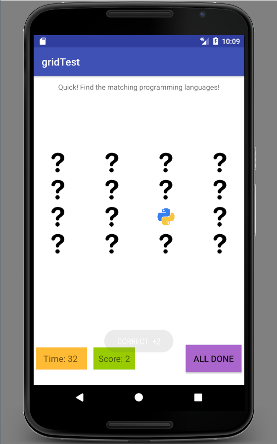

# dynamic-tiles
Android mobile game

This project lets the user play a simple matching game with images of Dynamic Programming Languages : )
 
The start screen of the game is a 4x4 grid with ‘?’ images. The user has to click on the question marks to reveal a logo of a programming language and find any 2 matching images which are then erased from the grid. Only one image appears at the time and the images are randomly set on the board. 
 

The user is notified with a pop-up dialogue for a correct match and earns +2 points on the Score tracker.
The user is constrained by a preset Timer and the goal is to clear the board before the Time runs out to get a perfect score (16/16)!
 

After the Time Up! message, the user can check the results by clicking the All Done button, which leads to the end game screen. The user can replay the game if not satisfied with the final score or wishes to improve the score.

 

Happy matching and getting acquainted with some dynamic programming languages : )

